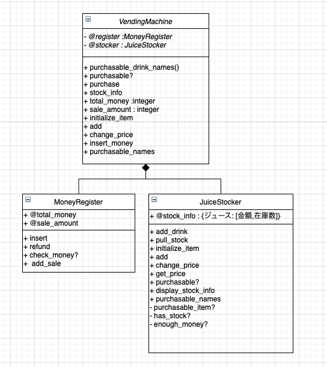

# VendingMachine

## 課題内容
http://devtesting.jp/tddbc/?TDDBC大阪3.0%2F課題

## 使用方法
1. ファイルの読み込み
    ```
    require './lib/vending_machine'
    ```
1. インスタンス生成
    ```
    machine = VendingMachine.new
    ```
1. 商品の登録を行う
    ```
    machine.initialize_item("cola",120)
    machine.initialize_item("redbull",200)
    machine.initialize_item("water",100)
    ```
1. 商品の在庫を補充する
    ```
    machine.add("cola",5)
    machine.add("redbull",6)
    machine.add("water",7)
    ```
1. お金を投入する
    ```
    machine.insert_money(1000)
    ＃ 投入金額の合計が表示されます
    ```
1. 投入金額の合計を確認する
    ```
    machine.total_money
    ```
1. 購入可能なドリンクの一覧を取得する
    ```
    machine.purchasable_names
    ＃ 購入可能なドリンクの一覧が出力されます
    ```
1. 指定したドリンクが購入可能かを取得する
    ```
    machine.purchasable?("cola")
    ＃ 購入可能か表示されます
    ```
1. ドリンクを購入する
    ```
    machine.purchase("cola")
    # お釣りが出力されます
    ```
1. 在庫を確認する
    ```
    machine.stock_info
    ```
1. 売り上げ金額を確認する
    ```
    machine.sale_amount
    ```

## 開発
### 開発体制
- leader
  - 松本  
- observer
  - 松尾
- driver
  - 大須賀
  - 高木

### 開発環境
`Ruby: 2.6.5`

####  インストール方法
1. 指定したRubyのバージョンのインストールコマンド
    ```
    rbenv install 2.6.5
    ```
1. インストールしたRubyを使用可能な状態にするコマンド
    ```
    rbenv rehash
    ```
1. Rubyバージョン切り替えコマンド
    ```
    rbenv global 2.6.5
    ```
1. バージョン確認コマンド
    ```
    ruby -v
    ```

### 開発リポジトリをローカルに落とす
リポジトリのクローン(初回のみ)

```
git clone 
```

### 開発の手順
1. GitHub上で実施するIssueを選ぶ
1. GitHub上で実施するIssueの担当者を自分に変更する
1. ローカルでDeveropブランチからブランチを作成する
    ```
    git checkout -bブランチ名
    ```
    - ブランチは下記のルールとする
      - Issueとブランチを１対１で紐付ける
      - Issue名称
        - IssueID + 何を行うか（英語）
1. 開発を行う。
    - 適宜コミットを行う。
    - コミットメッセージのルール
      - git commit -m 'Add コミットメッセージ'
        - 機能追加
          - Add
        - 機能修正
          - Updat
        - バグ修正
          - Fix
        - 削除
          - Remove
1. Issueに記載されている機能の実装が終了したら、GitHubにあげる。
    ```
    git push origin HEAD
    ```
1. GitHub上でPullRequestを行う。
1. もう片方のチームが確認を行い、Margeを行う。
  - Margeを行う際はコメントにclose #イシュIDをつける。

## クラス図
要修正

